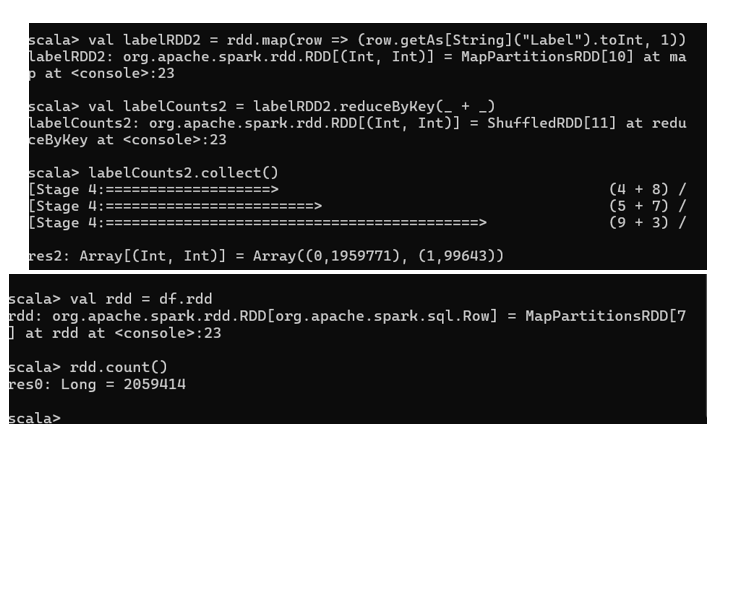

# Girl 1 - Label Distribution

## Analysis Question
What is the distribution of Normal and Attack records in the final preprocessed dataset?

## RDD Operations Used
Transformations: map, reduceByKey  
Actions: collect, count

## Scala Code
```scala
val df = spark.read.parquet(
  "C:/Users/asanv/Downloads/last semester/Big data system 462/Project/BigData Project/preprocessed_dataset.parquet"
)

val rdd = df.rdd

val totalRecords = rdd.count()

val labelRDD = rdd.map(row => (row.getAs[String]("Label").toInt, 1))

val labelCounts = labelRDD.reduceByKey(_ + _)

val distribution = labelCounts.collect()

println("Total records: " + totalRecords)
distribution.foreach(println)


 
## Sample Results
Normal (Label 0): 1,959,771  
Attack (Label 1): 99,643  
Total Records: 2,059,414  

## Insight
The final preprocessed dataset contains a much larger number of Normal records than Attack records, indicating a strong class imbalance. This imbalance should be considered during the machine learning phase because it may affect model training and evaluation.

## Sample Output

