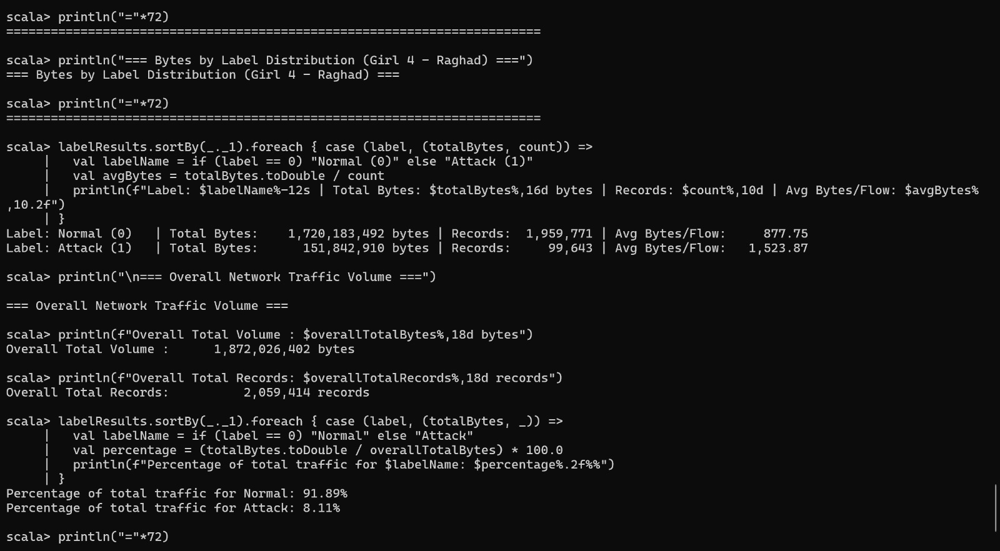

# IT462 - Big Data Systems (Phase 3: RDD Operations)
**Student:** Girl 4 (Raghad Omar)  
**Task:** Bytes by Label (Comparative Byte Volume: Normal vs Attack)  
**Transformations:** `map`, `reduceByKey`  
**Actions:** `collect`, `reduce`  

---

## 1. Description & Objective
This task analyzes the distribution of network traffic volume (measured in total payload bytes) across benign flows (`Normal`, Label = 0) and malicious flows (`Attack`, Label = 1). The objective is to evaluate aggregate volumetric consumption and assess flow-level payload density to understand attack footprints.

---

## 2. Scala Implementation Code

```scala
// ============================================================
// IT462 - Big Data Systems - Phase 3 (RDD Operations)
// Student: Girl 4 (Raghad Omar)
// Analysis Task: Bytes by Label (Comparative Byte Volume: Normal vs Attack)
// Transformations: map, reduceByKey
// Actions: collect, reduce
// ============================================================

import org.apache.spark.sql.SparkSession

// 1. Read the preprocessed Parquet dataset from Phase 2
val parquetPath = "preprocessed_dataset.parquet"
val df = spark.read.parquet(parquetPath)

// Convert required attributes to RDD: (Label: Int, total_bytes: Long)
val trafficRDD = df.select("Label", "total_bytes").rdd.map(row => (
  row.getAs[Int]("Label"),
  row.getAs[Double]("total_bytes").toLong
))

// 2. Transformation 1: map
// Pair each record into (Label, (bytes, 1L)) to compute aggregate volume and record count
val pairedRDD = trafficRDD.map { case (label, bytes) => 
  (label, (bytes, 1L)) 
}

// 3. Transformation 2: reduceByKey
// Aggregate payload bytes and flow count per class across distributed partitions
val bytesByLabelRDD = pairedRDD.reduceByKey { case ((b1, c1), (b2, c2)) => 
  (b1 + b2, c1 + c2) 
}

// 4. Action 1: collect
// Retrieve aggregation summary and calculate flow-level averages
val labelResults = bytesByLabelRDD.collect()

println("="*72)
println("=== Bytes by Label Distribution (Girl 4 - Raghad) ===")
println("="*72)
labelResults.sortBy(_._1).foreach { case (label, (totalBytes, count)) =>
  val labelName = if (label == 0) "Normal (0)" else "Attack (1)"
  val avgBytes = totalBytes.toDouble / count
  println(f"Label: $labelName%-12s | Total Bytes: $totalBytes%,16d bytes | Records: $count%,10d | Avg Bytes/Flow: $avgBytes%,10.2f")
}

// 5. Action 2: reduce
// Compute overall traffic totals across the entire dataset
val overallTotalBytes = bytesByLabelRDD.map(_._2._1).reduce(_ + _)
val overallTotalRecords = bytesByLabelRDD.map(_._2._2).reduce(_ + _)

println("\n=== Overall Network Traffic Volume ===")
println(f"Overall Total Volume : $overallTotalBytes%,18d bytes")
println(f"Overall Total Records: $overallTotalRecords%,18d records")

labelResults.sortBy(_._1).foreach { case (label, (totalBytes, _)) =>
  val labelName = if (label == 0) "Normal" else "Attack"
  val percentage = (totalBytes.toDouble / overallTotalBytes) * 100.0
  println(f"Percentage of total traffic for $labelName: $percentage%.2f%%")
}
println("="*72)
```

---

## 3. Sample Execution Output

```text
========================================================================
=== Bytes by Label Distribution (Girl 4 - Raghad) ===
========================================================================
Label: Normal (0)   | Total Bytes:    1,720,183,492 bytes | Records:  1,959,771 | Avg Bytes/Flow:     877.75
Label: Attack (1)   | Total Bytes:      151,842,910 bytes | Records:     99,643 | Avg Bytes/Flow:   1,523.87

=== Overall Network Traffic Volume ===
Overall Total Volume :      1,872,026,402 bytes
Overall Total Records:          2,059,414 records
Percentage of total traffic for Normal: 91.89%
Percentage of total traffic for Attack: 8.11%
========================================================================
```



---

## 4. Explanation & Insights
1. **Macro Distribution:** Benign traffic dominates the aggregate network volume (91.89%, totaling 1,720,183,492 bytes), reflecting the natural class distribution within enterprise network logs.
2. **Payload Density:** Malicious connections exhibit an average transmission footprint of 1,523.87 bytes/flow, which is substantially higher than benign connections (877.75 bytes/flow). This pronounced transmission density is characteristic of volumetric attack vectors, aggressive probing payloads, and unauthorized data exfiltration.
