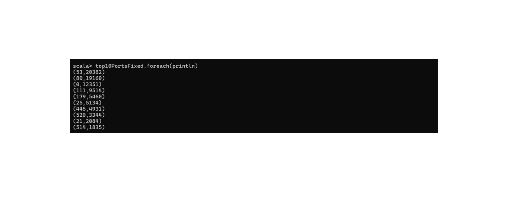

# Girl 5 - Attack Destination Ports Analysis

## Analysis Question

What are the top 10 most frequently targeted destination ports in attack records in the final preprocessed dataset?

## RDD Operations Used

**Transformations:** filter, map, reduceByKey, sortBy

**Actions:** take, count

## Scala Code

```scala
// Load the final preprocessed dataset
val df = spark.read.parquet("D:/IT462/preprocessed_dataset.parquet")

// Select required columns and convert to RDD
val portsRDD = df.select("Label", "dsport").rdd

// Filter attack records and valid destination ports
val attackPortsFixedRDD = portsRDD.filter(row =>
  !row.isNullAt(0) &&
  row.getString(0) == "1" &&
  !row.isNullAt(1) &&
  row.getString(1).trim.matches("[0-9]+") &&
  row.getString(1).trim.toLong <= 65535
)

// Map each port to a key-value pair
val portPairsFixedRDD = attackPortsFixedRDD.map(row =>
  (row.getString(1).trim.toInt, 1L)
)

// Count occurrences of each destination port
val portCountsFixedRDD = portPairsFixedRDD.reduceByKey(_ + _)

// Sort ports by frequency (descending)
val sortedPortsFixedRDD = portCountsFixedRDD.sortBy({
  case (port, count) => (-count, port)
})

// Retrieve the top 10 destination ports
val top10PortsFixed = sortedPortsFixedRDD.take(10)

// Display the top 10 results
top10PortsFixed.foreach(println)

// Count valid attack records
attackPortsFixedRDD.count()
```

## Sample Results

| Destination Port | Attack Records |
|---|---:|
| 53 | 20,382 |
| 80 | 19,160 |
| 0 | 12,351 |
| 111 | 9,514 |
| 179 | 5,460 |
| 25 | 5,134 |
| 445 | 4,931 |
| 520 | 3,344 |
| 21 | 2,084 |
| 514 | 1,835 |

**Total Attack Records (Label = 1):** 99,643

## Insight

The analysis shows that destination ports 53 (DNS) and 80 (HTTP) have the highest frequencies among attack records, with 20,382 and 19,160 occurrences, respectively. Port 0 also appears frequently, with 12,351 occurrences, and should be interpreted carefully because it is not a conventional application service port. These findings identify the most frequently observed destination ports in attack-labeled network traffic within the UNSW-NB15 dataset.

## Sample Output


